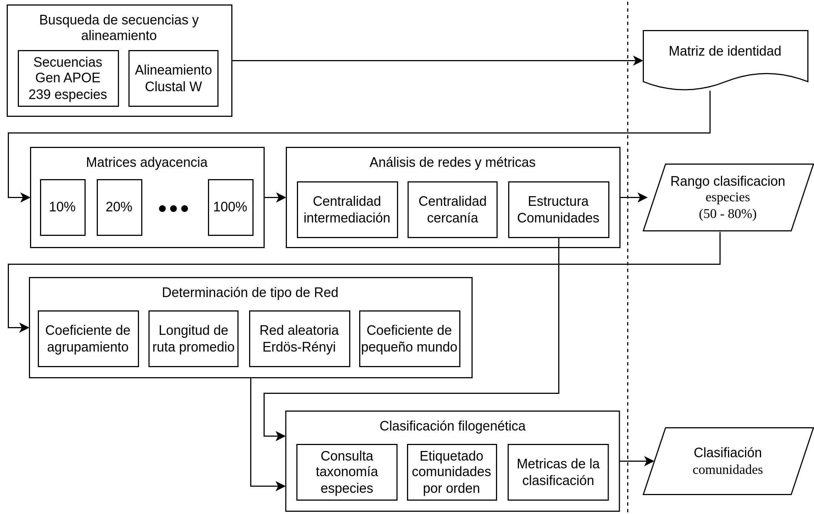

# species-network
Complex networks analysis for orthologous genes in vertebrates: a micro- and macro-scale evolution study. Análisis de redes complejas para genes ortólogos en vertebrados: un estudio a escala micro y macro de la evolución.

## Metodología para el Análisis de Redes Complejas con Información Genética

A continuación, se presenta el procedimiento metodológico para desarrollar un análisis de redes complejas con información genética estudiando el gen ortólogo APOE.



### Búsqueda de Secuencias y Alineamiento

1. **Búsqueda de secuencias:** Se encontraron secuencias del gen APOE para 239 especies en [(NCBI, 2022)](https://www.ncbi.nlm.nih.gov/gene/348/ortholog/) descargandolas en la opción de formato FASTA.
2. **Importación de las secuencias a BioEdit:** Se usó el software [BioEdit](https://thalljiscience.github.io/) y se cargaron las secuencias en el programa. Esto se realizó desde File -> Import from file y seleccionando el archivo FASTA.
3. **Alineamiento de las secuencias:** Una vez cargadas las secuencias, se alinearon utilizando un programa de alineación múltiple como ClustalW, que está integrado en BioEdit. Acceder al menu Alignment -> Multiple Alignment -> Run ClustalW Multiple Alignment y seguir las indicaciones para realizar el alineamiento.

### Matriz de Identidad

1. **Cálculo de la matriz:** A partir del alineamiento, se calculó una matriz de identidad de las secuencias en el software Bioedit accediendo al menu Alignment -> Pairwise Alignment -> Create Identity Matrix.
2. **Guardar o visualizar la matriz:** BioEdit generó la matriz de identidad, que se puede ver en la pantalla o guardar en un archivo para análisis posterior.
3. **Formato del archivo:** La matriz se guardó en un archivo de texto [MatrizAPOE.txt](1-IdentityMatrices/MatrizAPOE.txt) separado por tabuladores. Las filas y columnas de la matriz representan cada especie, y los coeficientes indican el porcentaje de identidad entre las secuencias genéticas de las dos especies referenciadas.

### Matrices de Adyacencia

1. **Conversión a matriz binaria:** Se calcularon matrices de adyacencia mediante un proceso en el que las relaciones representadas como porcentajes en la matriz de identidad son transformadas a una relación binaria en las matrices de adyacencia. A continuación se presenta el algoritmo propuesto:

2. **Rangos de adyacencia:** Para la matriz de adyacencia del 10 %, se pone en cada coeficiente el valor de uno si la identidad entre dos especies es superior al 10 % y un coeficiente de cero en caso contrario. Se calcularon matrices de adyacencia para valores de identidad entre 10 y 100 % con intervalos de 10 %. El algoritmo en python empleado esta disponible en el notebook [species.ipynb](2-AdjacencyMatrices/species.ipynb). Las matrices binarias para los porentajes de identidad fueron las siguientes:

- [APOE 10%](2-AdjacencyMatrices/matrixAPOE10Wolfram.txt)
- [APOE 20%](2-AdjacencyMatrices/matrixAPOE20Wolfram.txt)
- [APOE 30%](2-AdjacencyMatrices/matrixAPOE30Wolfram.txt)
- [APOE 40%](2-AdjacencyMatrices/matrixAPOE40Wolfram.txt)
- [APOE 50%](2-AdjacencyMatrices/matrixAPOE50Wolfram.txt)
- [APOE 60%](2-AdjacencyMatrices/matrixAPOE60Wolfram.txt)
- [APOE 70%](2-AdjacencyMatrices/matrixAPOE70Wolfram.txt)
- [APOE 80%](2-AdjacencyMatrices/matrixAPOE80Wolfram.txt)
- [APOE 90%](2-AdjacencyMatrices/matrixAPOE90Wolfram.txt)
- [APOE 100%](2-AdjacencyMatrices/matrixAPOE100Wolfram.txt)

### Análisis de Redes y Métricas

1. **Cálculo de métricas:** Cada matriz de adyacencia representa una red compleja que puede analizarse usando metodologías de ciencias de redes.
2. **Tipos de métricas:** Se calculan y analizan métricas como centralidad por intermediación, estructura de comunidades y diversas representaciones gráficas de las redes con parámetros como el coeficiente de agrupamiento y la longitud promedio de la ruta.
3. **Herramientas utilizadas:** La lógica empleada para este análisis se desarrolló en notebooks de Wolfram Mathematica [(Wolfram Research Inc., 2022)](https://www.wolfram.com/mathematica/). Se crearon varios notebook tomando como punto de partida cada archivo de matriz de adyacencia obtenido en la seccion anterior e incluyendo las matrices en el respectivo notebook. Los archivos de los notebook son los siguientes:

- [Notebook Apoe 10%](3-NetworkAnalisys/EspeciesAPOE10.nb)
- [Notebook Apoe 20%](3-NetworkAnalisys/EspeciesAPOE20.nb)
- [Notebook Apoe 30%](3-NetworkAnalisys/EspeciesAPOE30.nb)
- [Notebook Apoe 40%](3-NetworkAnalisys/EspeciesAPOE40.nb)
- [Notebook Apoe 50%](3-NetworkAnalisys/EspeciesAPOE50.nb)
- [Notebook Apoe 60%](3-NetworkAnalisys/EspeciesAPOE60.nb)
- [Notebook Apoe 70%](3-NetworkAnalisys/EspeciesAPOE70.nb)
- [Notebook Apoe 80%](3-NetworkAnalisys/EspeciesAPOE80.nb)
- [Notebook Apoe 90%](3-NetworkAnalisys/EspeciesAPOE90.nb)
- [Notebook Apoe 100%](3-NetworkAnalisys/EspeciesAPOE100.nb)

4. **Resumen de metricas obtenidas** A continuacién se presenta el resumén de algunas métricas obtenidas para varios porcentajes de identidad de la metodologéa empleada:


4. **Acceso a los notebook** Los notebook utilizados superan el tamaño de almacenamiento de github por lo cual se utilizo la tecnologia [LFS](https://docs.github.com/es/repositories/working-with-files/managing-large-files) para poderlos compartir. Desde web se descargaria una version enmascarada en LFS por lo cual no se accederia a su contenido real. El siguiente procedimiento se podria usar para abrir estos archivo del repositorio:

***Instalar Git y Git LFS*** Se debe tener Git y Git LFS instalados en el sistema. Pueden ser instalardos desde sus sitios oficiales:

- [Instalar Git](https://git-scm.com/book/en/v2/Getting-Started-Installing-Git)
- [Instalar Git LFS](https://git-lfs.github.com/)

***Clonar el repositorio*** Abrir una terminal y ejecutar los siguientes comandos para clonar el repositorio. Git LFS se encargará de descargar los archivos grandes.

```bash
git lfs install
git clone https://github.com/jandresh/species-network.git
```

***Ver los archivos*** Una vez que el repositorio se haya clonado, se ingresa al directorio donde se descargó y se abren los archivos de interés.

```bash
cd species-network
```

### Rango Clasificación de Especies

1. **Delimitación de rangos:** Teniendo en cuenta las métricas calculadas, se delimitó un rango para escoger matrices de adyacencia entre 50 y 80 %.
2. **Criterios:** Este rango se definió considerando las características de las redes obtenidas y sus métricas dado que en estos valores de identidad se observan parámetros que corresponden a redes de mundo pequeño.

### Determinación de Tipo de Red

En la parte final de los notebook presentados en la seccion Análisis de Redes y Métricas se pueden observar los siguiente procedimientos:

1. **Generación de grafos aleatorios:** Se generaron grafos aleatorios siguiendo el modelo de Erdös-Rényi.
2. **Coeficiente de mundo pequeño:** Se obtuvo la métrica de coeficiente de mundo pequeño (small-worldness) empleando la ecuación `sw = γ / λ`, donde `γ = Cg / Cn` y `λ = lg / ln`. `Cg` y `Cn` son los coeficientes de agrupamiento de la red evaluada y la red aleatoria simulada, respectivamente, y `lg` y `ln` son las longitudes promedio del camino de la red evaluada y la red aleatoria simulada [(Humphries y Gurney, 2008)](https://doi.org/10.1371/journal.pone.0002051).

### Clasificación Filogenética

1. **Clasificación automática de comunidades para identidad del 80% gen APOE** A partir de la red representada por la matriz de adyacencia, se obtuvo la clasificación automática de comunidades [(Wolfram Research Inc., 2023)](https://reference.wolfram.com/language/ref/FindGraphCommunities.html).
- [Lista Especies](2-AdjacencyMatrices/SpeciesListAPOE.txt)
- [Agrupación proveniente del grafo de comunidades anotado con el orden consultado en NCBI](4-PhylogeneticClassification/CommunitiesAPOE.txt)
- Grafos obtenidos:


2. **Consulta taxonómica y comparacion con comunidades obtenidas** Se consultó para cada nodo-especie la taxonomía en una base de datos [(NCBI, 2023)](https://www.ncbi.nlm.nih.gov/taxonomy). Cada comunidad representa una lista de especies, y al etiquetar la taxonomía consultada, se evidencia la concordancia de la clasificación taxonómica a nivel de orden con las comunidades encontradas automáticamente. Cada color en el grafo corresponde a la clasificacion obtenida en este trabajo. Se muestra que el análisis de redes sin conocer la taxonomía logra realizar clasificación de especies.

[Version interactiva, descargar y ver en explorador.](4-PhylogeneticClassification/interactiveTaxonomyGraph.html)

## Licencia
Este proyecto está licenciado bajo los términos de la [Licencia MIT](LICENSE).

## Autores
Este trabajo está siendo desarrollado por [Juan Ramiro Orjuela](mailto:juan.orjuela@correounivalle.edu.co), [Jaime Andrés Hurtado](mailto:jaime.hurtado@correounivalle.edu.co), [Víctor Bucheli](mailto:victor.bucheli@correounivalle.edu.co) como trabajo investigativo con afiliacion a la [Universidad del Valle](https://univalle.edu.co/) en Cali, Colombia.
